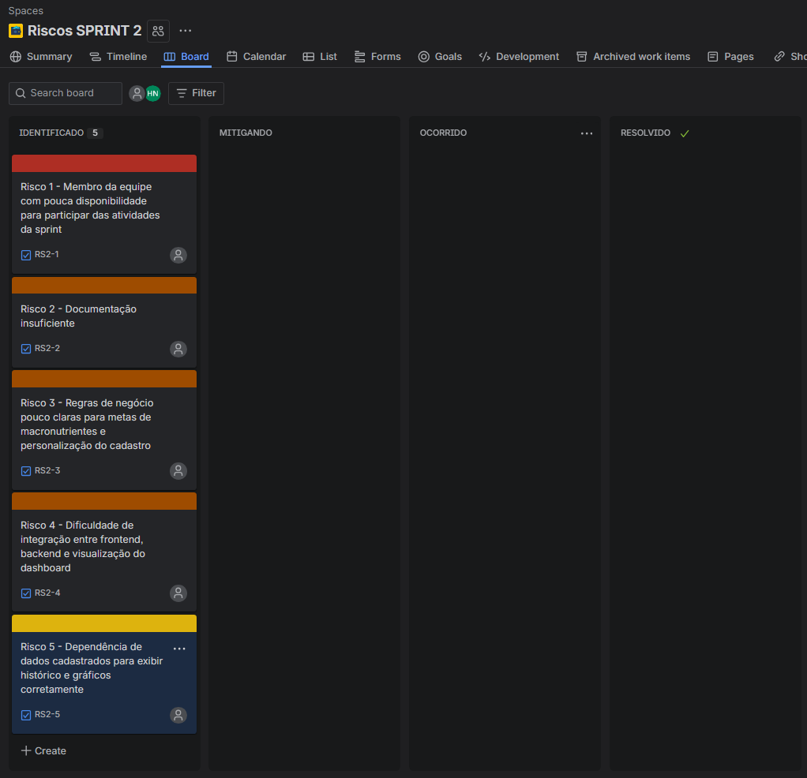

# Relatório de Poker Planning - Sprint 2

## 1) Lista de histórias com estimativas

| ID | História de usuário | Story Points |
| --- | --- | ---: |
| HU06 | Como usuário, quero definir metas diárias de macronutrientes (proteínas, calorias, carboidratos e gorduras) para acompanhar minha dieta. | 13 |
| HU07 | Como usuário, quero visualizar meu histórico de refeições para analisar minha evolução alimentar. | 8 |
| HU08 | Como usuário, quero adicionar altura no cadastro para melhorar o cálculo e a personalização dos dados. | 3 |
| HU09 | Como usuário, quero fazer logout para encerrar minha sessão com segurança. | 1 |
| HU10 | Como usuário, quero melhorias no dashboard com gráfico de consumo de calorias ao longo da semana para ter uma visão rápida do meu progresso. | 13 |

## Registro visual do Poker Planning

### Discordância

### Concordância média

### Concordância total

## 2) Total de pontos da sprint + justificativa

**Total de Story Points da Sprint 2: 38 pontos**

Cálculo:

$$13 + 8 + 3 + 1 + 13 = 38$$

Justificativa da composição da sprint:
- A sprint combina **duas histórias de alta complexidade** (13 pontos cada), com maior impacto no valor para o usuário: metas diárias e evolução do dashboard.
- Inclui **uma história de complexidade média** (8 pontos), importante para usabilidade e análise de evolução.
- Inclui **duas histórias menores** (3 e 1 ponto), que ajudam a equilibrar o fluxo de entrega e reduzir risco de bloqueio no fim da sprint.
- O conjunto foi definido para manter um backlog viável dentro da capacidade do time, balanceando valor de negócio, esforço técnico e dependências entre frontend e backend.

## 3) Breve reflexão do time

### Dificuldades encontradas
- Ausência de parte do time no encontro de estimativa: participaram apenas 2 de 4 integrantes.
- Diferenças de percepção sobre o esforço das histórias que envolvem visualização de dados e integração de informações já cadastradas.

### Como o grupo chegou ao consenso
- O time discutiu critérios comuns antes da votação (complexidade técnica, dependências e risco).
- No poker planning, quando houve divergência, cada pessoa justificou o voto com base no trabalho esperado.
- Após debate curto, foi feita nova rodada de votação até convergir para os pontos finais.

### Principais aprendizados
- Histórias de dashboard tendem a esconder complexidade de dados e devem ser discutidas com mais atenção.
- O poker planning funciona melhor quando há alinhamento prévio sobre definição de pronto e escopo técnico mínimo.

## 4) Riscos iniciais da Sprint 2

Os impedimentos observados na Sprint 1 foram convertidos em riscos para a Sprint 2, junto com os riscos naturais das histórias planejadas nesta etapa.

| Risco | Origem | Probabilidade | Impacto | Mitigação | Contingência |
| --- | --- | --- | --- | --- | --- |
| Membro da equipe com pouca disponibilidade para participar das atividades da sprint | Impedimento da Sprint 1: faltaram integrantes nas discussões | Alta | Alto | Dividir tarefas em blocos menores, acompanhar o andamento com mais frequência e redistribuir demandas entre os membros disponíveis | Replanejar as prioridades da sprint e ajustar o escopo das histórias para caber na capacidade real do time |
| Documentação insuficiente | Impedimento da Sprint 1: necessidade de melhorar a documentação | Média | Alto | Atualizar as histórias, critérios de aceite e decisões logo após cada reunião | Reservar um ajuste específico de documentação antes de seguir para implementação ou revisão |
| Regras de negócio pouco claras para metas de macronutrientes e personalização do cadastro | Novo risco das histórias da Sprint 2 | Média | Alto | Validar as regras com o time e com o PO antes de codificar, com exemplos práticos de uso | Implementar uma versão mínima e deixar ajustes finos para uma iteração posterior |
| Dificuldade de integração entre frontend, backend e visualização do dashboard | Novo risco das histórias da Sprint 2 | Média | Alto | Criar o dashboard com as bibliotecas escolhidas desde o início, validar os componentes visuais com dados simulados e reduzir dependências entre as partes | Usar dados simulados temporariamente e liberar a entrega em incrementos menores |
| Dependência de dados cadastrados para exibir histórico e gráficos corretamente | Novo risco das histórias da Sprint 2 | Média | Médio | Criar dados de teste e validar os cenários de usuário desde o início | Exibir estados vazios e mensagens orientando o usuário quando não houver dados suficientes |

### Leitura dos riscos
- Os riscos de maior prioridade são os que combinam **alta probabilidade** e **alto impacto**, principalmente participação do time, gestão de tempo e clareza das regras.
- Os riscos de integração e de documentação devem ser monitorados ao longo da sprint, porque afetam diretamente o andamento do desenvolvimento e da validação.
- O acompanhamento semanal dos riscos ajuda a atualizar a prioridade e acionar a mitigação antes que o problema afete a entrega.