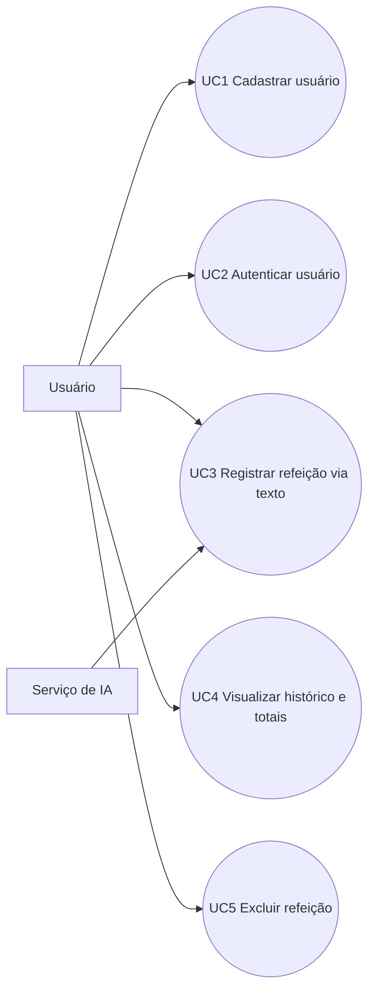

# Atividade — Estimativa por Pontos por Casos de Uso (PUC)

## Objetivo
Estimar a complexidade do projeto **Gerenciador de Calorias** com PUC e definir os Casos de Uso da **Sprint 1 (2 semanas)**.

## Parâmetros da atividade
- Produtividade: **8 horas por PUC**
- DA: **23**
- Valor hora: **R$ 80,00**

## Regra de capacidade da Sprint 1
Fórmula obrigatória:

$$Capacidade\ da\ Sprint = N^\circ\ de\ integrantes \times 80h \times 0{,}7$$

Premissa adotada para esta entrega: **4 integrantes**.

$$Capacidade = 4 \times 80 \times 0{,}7 = 224h$$

Referência:
- 3 integrantes → 168h
- 4 integrantes → 224h
- 5 integrantes → 280h

---

## 1) Derivação dos Casos de Uso a partir do backlog

Mapeamento HU → UC:
- HU01 → UC1 Cadastrar usuário
- HU02 → UC2 Autenticar usuário (login/logout)
- HU03 → UC3 Registrar refeição via texto (IA)
- HU04 → UC4 Visualizar histórico e totais diários
- HU05 → UC5 Excluir refeição

---

## 2) Diagrama de Casos de Uso

---

## 3) Cálculo dos PUCs

Critérios utilizados:
- Tipo de interação
- Regras de negócio
- Entidades manipuladas
- Manipulação de dados (CRUD)

### 3.1 Pontos Não Ajustados (PNA)

| UC | Interação | Regras | Entidades | CRUD | Total UC |
| --- | ---: | ---: | ---: | ---: | ---: |
| UC1 Cadastrar usuário | 3 | 1 | 1 | 2 | 7 |
| UC2 Autenticar usuário | 3 | 1 | 1 | 1 | 6 |
| UC3 Registrar refeição (IA) | 3 | 3 | 3 | 2 | 11 |
| UC4 Visualizar histórico | 3 | 2 | 2 | 1 | 8 |
| UC5 Excluir refeição | 3 | 2 | 2 | 1 | 8 |

$$PNA = 7 + 6 + 11 + 8 + 8 = 40$$

### 3.2 Fator ambiental
- DA = 23
- Faixa DA 12–23 → **C = 1**

### 3.3 Pontos Ajustados e PUC

$$PA = PNA \times C = 40 \times 1 = 40$$

$$PUC = \frac{PA \times DA}{36} = \frac{40 \times 23}{36} = 25{,}56$$

**PUC total do projeto: 25,56**

### 3.4 PUC e horas por Caso de Uso

Usando $PUC_i = \frac{(Total\ UC_i) \times 23}{36}$ e $Horas_i = PUC_i \times 8$:

| UC | Total UC | PUC (aprox.) | Horas (aprox.) |
| --- | ---: | ---: | ---: |
| UC1 | 7 | 4,47 | 35,78h |
| UC2 | 6 | 3,83 | 30,67h |
| UC3 | 11 | 7,03 | 56,22h |
| UC4 | 8 | 5,11 | 40,89h |
| UC5 | 8 | 5,11 | 40,89h |
| **Total** | **40** | **25,56** | **204,44h** |

---

## 4) Esforço total e custo

$$Esforço\ total = PUC \times 8 = 25{,}56 \times 8 = 204{,}44h$$

$$Custo\ total = Esforço\ (h) \times 80 = 204{,}44 \times 80 = R\$\ 16.355{,}20$$

---

## 5) Definição da Sprint 1 (Sprint Backlog)

Capacidade da equipe na Sprint 1:

$$224h$$

Seleção de Casos de Uso para Sprint 1:
- UC1 Cadastrar usuário
- UC2 Autenticar usuário
- UC3 Registrar refeição via texto (IA)
- UC4 Visualizar histórico e totais diários

Soma estimada:

$$35{,}78 + 30{,}67 + 56{,}22 + 40{,}89 = 163{,}56h$$

Validação:

$$163{,}56h \leq 224h$$

✅ A Sprint 1 respeita a capacidade da equipe.

UC não incluído na Sprint 1:
- UC5 Excluir refeição (Sprint 2)

---

## 6) Links de entrega
- Trello (Sprint Backlog): https://trello.com/b/7jleyhNv/backlog-gerenciador-de-calorias
- Git (atualizações do projeto): https://github.com/PedroSatoru/Gerenciador-de-Calorias
